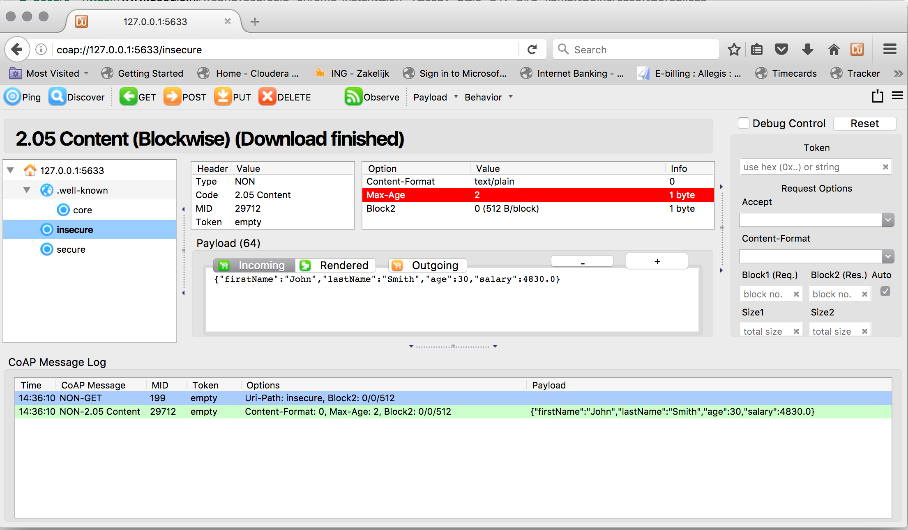

Kafka Connect CoAP Sink
=======================

A Connector and Sink to stream messages from Kafka to a CoAP server.

The Sink supports:

1. DTLS secure clients.
2. :ref:`The KCQL routing querying <kcql>` - Topic to measure mapping and Field selection.
3. Schema registry support for Connect/Avro with a schema.
4. Schema registry support for Connect and no schema (schema set to Schema.String)
5. Json payload support, no Schema Registry.
6. Error policies.
7. Payload support for Schema.Struct and payload Struct, Schema.String and Json payload and Json payload with no schema

The Sink supports three Kafka payloads type:

**Connect entry with Schema.Struct and payload Struct.** If you follow the best practice while producing the events, each
message should carry its schema information. Best option is to send Avro. Your connect configurations should be set to
``value.converter=io.confluent.connect.avro.AvroConverter``.
You can find an example `here <https://github.com/confluentinc/kafka-connect-blog/blob/master/etc/connect-avro-standalone.properties>`__.
To see how easy is to have your producer serialize to Avro have a look at
`this <http://docs.confluent.io/3.0.1/schema-registry/docs/serializer-formatter.html?highlight=kafkaavroserializer>`__.
This requires the SchemaRegistry which is open source thanks to Confluent! Alternatively you can send Json + Schema.
In this case your connect configuration should be set to ``value.converter=org.apache.kafka.connect.json.JsonConverter``. This doesn't
require the SchemaRegistry.

**Connect entry with Schema.String and payload json String.** Sometimes the producer would find it easier, despite sending
Avro to produce a GenericRecord, to just send a message with Schema.String and the json string.

**Connect entry without a schema and the payload json String.** There are many existing systems which are publishing json
over Kafka and bringing them in line with best practices is quite a challenge. Hence we added the support

The payload of the CoAP request sent to the CoAP server is sent as json.

Prerequisites
-------------

- Confluent 3.2
- Java 1.8
- Scala 2.11

Setup
-----

Confluent Setup
~~~~~~~~~~~~~~~

Follow the instructions :ref:`here <install>`.

CoAP Setup
~~~~~~~~~~

The connector uses `Californium <https://github.com/eclipse/californium>`__ Java API under the hood. Copper, a `FireFox <https://addons.mozilla.org/en-US/firefox/addon/copper-270430/>`__ browser
addon is available so you can browse the server and resources.

We will use a simple CoAP test server we have developed for testing. Download the CoAP test server from our github release page and start
the server in a new terminal tab.

.. sourcecode:: bash

    mkdir coap_server
    cd coap_server
    wget https://github.com/datamountaineer/coap-test-server/releases/download/v1.0/start-server.sh
    chmod +x start-server.sh
    ./start-server.sh

You will see the server start listening on port ``5864`` for secure DTLS connections and on port ``5633`` for insecure connections.

.. sourcecode:: bash

    m.DTLSConnector$Worker.java:-1) run() in thread DTLS-Receiver-0.0.0.0/0.0.0.0:5634 at (2017-01-10 15:41:08)
     1 INFO [CoapEndpoint]: Starting endpoint at localhost/127.0.0.1:5633 - (org.eclipse.californium.core.network.CoapEndpoint.java:192) start() in thread main at (2017-01-10 15:41:08)
     1 CONFIG [UDPConnector]: UDPConnector starts up 1 sender threads and 1 receiver threads - (org.eclipse.californium.elements.UDPConnector.java:261) start() in thread main at (2017-01-10 15:41:08)
     1 CONFIG [UDPConnector]: UDPConnector listening on /127.0.0.1:5633, recv buf = 65507, send buf = 65507, recv packet size = 2048 - (org.eclipse.californium.elements.UDPConnector.java:261) start() in thread main at (2017-01-10 15:41:08)
    Secure CoAP server powered by Scandium (Sc) is listening on port 5634
    UnSecure CoAP server powered by Scandium (Sc) is listening on port 5633

Source Connector QuickStart
---------------------------

We will start the connector in distributed mode. Each connector exposes a rest endpoint for stopping, starting and updating the configuration. We have developed
a Command Line Interface to make interacting with the Connect Rest API easier. The CLI can be found in the Stream Reactor download under
the ``bin`` folder. Alternatively the Jar can be pulled from our GitHub
`releases <https://github.com/datamountaineer/kafka-connect-tools/releases>`__ page.

Starting the Connector
~~~~~~~~~~~~~~~~~~~~~~

Download, unpack and install the Stream Reactor. Follow the instructions :ref:`here <install>` if you haven't already done so.
All paths in the quickstart are based in the location you installed the Stream Reactor.

Start Kafka Connect in distributed more by running the ``start-connect.sh`` script in the ``bin`` folder.

.. sourcecode:: bash

    ➜ bin/start-connect.sh

Once the connector has started we can now use the kafka-connect-tools cli to post in our distributed properties file for MQTT.
If you are using the :ref:`dockers <dockers>` you will have to set the following environment variable to for the CLI to
connect to the Rest API of Kafka Connect of your container.

.. sourcecode:: bash

   export KAFKA_CONNECT_REST="http://myserver:myport"

.. sourcecode:: bash

    ➜  bin/cli.sh create coap-source < conf/coap-source.properties

    #Connector name=`coap-sink`
    name = coap-sink
    tasks = 1
    connector.class = com.datamountaineer.streamreactor.connect.coap.sink.CoapSinkConnector
    connect.coap.uri = coap://localhost:5683
    connect.coap.kcql = INSERT INTO unsecure SELECT * FROM coap_topic
    topics = coap_topic
    #task ids: 0

The ``coap-source.properties`` file defines:

1.  The name of the sink.
2.  The name number of tasks.
3.  The class containing the connector.
4.  The uri of the CoAP Server and port to connect to.
5.  :ref:`The KCQL routing querying. <kcql>`. This specifies the target resources on the CoAP server and the source topic.
6.  The topics to source (Required by Connect Framework).

If you switch back to the terminal you started Kafka Connect in you should see the CoAP Sink being accepted and the
task starting.

We can use the CLI to check if the connector is up but you should be able to see this in logs as-well.

.. sourcecode:: bash

    #check for running connectors with the CLI
    ➜ bin/cli.sh ps
    coap-sink

.. sourcecode:: bash

    INFO
        ____        __        __  ___                  __        _
       / __ \____ _/ /_____ _/  |/  /___  __  ______  / /_____ _(_)___  ___  ___  _____
      / / / / __ `/ __/ __ `/ /|_/ / __ \/ / / / __ \/ __/ __ `/ / __ \/ _ \/ _ \/ ___/
     / /_/ / /_/ / /_/ /_/ / /  / / /_/ / /_/ / / / / /_/ /_/ / / / / /  __/  __/ /
    /_____/\__,_/\__/\__,_/_/  /_/\____/\__,_/_/ /_/\__/\__,_/_/_/ /_/\___/\___/_/
             ______                 _____ _       __
            / ____/___  ____ _____ / ___/(_)___  / /__    By Andrew Stevenson
           / /   / __ \/ __ `/ __ \\__ \/ / __ \/ //_/
          / /___/ /_/ / /_/ / /_/ /__/ / / / / / ,<
          \____/\____/\__,_/ .___/____/_/_/ /_/_/|_|
                          /_/ (com.datamountaineer.streamreactor.connect.coap.sink.CoapSinkTask:52)
    [2017-01-10 12:57:32,238] INFO CoapSinkConfig values:
        connect.coap.uri = coap://localhost:5683
        connect.coap.sink.bind.port = 0
        connect.coap.retry.interval = 60000
        connect.coap.truststore.pass = [hidden]
        connect.coap.cert.chain.key = client
        connect.coap.error.policy = THROW
        connect.coap.kcql = INSERT INTO unsecure SELECT * FROM coap_topic
        connect.coap.sink.bind.host = localhost
        connect.coap.certs = []
        connect.coap.max.retires = 20
        connect.coap.keystore.path =
        connect.coap.truststore.path =
        connect.coap.keystore.pass = [hidden]
     (com.datamountaineer.streamreactor.connect.coap.configs.CoapSinkConfig:178)

Test Records
^^^^^^^^^^^^

Now we need to put some records it to the coap_topic topics. We can use the ``kafka-avro-console-producer`` to do this.

Start the producer and pass in a schema to register in the Schema Registry. The schema has a ``firstname`` field of type
string, a ``lastname`` field of type string, an ``age`` field of type int and a ``salary`` field of type double.

.. sourcecode:: bash

    ${CONFLUENT_HOME}/bin/kafka-avro-console-producer \
      --broker-list localhost:9092 --topic coap-topic \
      --property value.schema='{"type":"record","name":"User","namespace":"com.datamountaineer.streamreactor.connect.rethink"
      ,"fields":[{"name":"firstName","type":"string"},{"name":"lastName","type":"string"},{"name":"age","type":"int"},{"name":"salary","type":"double"}]}'

Now the producer is waiting for input. Paste in the following:

.. sourcecode:: bash

    {"firstName": "John", "lastName": "Smith", "age":30, "salary": 4830}

Check for Records in the CoAP server via Copper
^^^^^^^^^^^^^^^^^^^^^^^^^^^^^^^^^^^^^^^^^^^^^^^

Now check the logs of the connector you should see this:

.. sourcecode:: bash

    [2017-01-10 13:47:36,525] INFO Delivered 1 records for coap-topic. (com.datamountaineer.streamreactor.connect.coap.sink.CoapSinkTask:47)

In Firefox go the following url. If you have not installed Copper do so `here <https://addons.mozilla.org/en-US/firefox/addon/copper-270430/>`__ .

.. sourcecode:: bash

    coap://127.0.0.1:5633/insecure

Hit the get button and the records will be displayed in the bottom panel.

Configurations
--------------

``connect.coap.uri``

Uri of the CoAP server.

* Data Type : string
* Importance: high
* Optional  : no

``connect.coap.kcql``

The KCQL statement to select and route resources to topics.

* Data Type : string
* Importance: high
* Optional  : no

``connect.coap.bind.port``

The port the DTLS connector will bind to on the Connector host.

* Data Type : int
* Importance: medium
* Optional  : yes
* Default   : 0

``connect.coap.bind.host``

The hostname the DTLS connector will bind to on the Connector host.

* Data Type : string
* Importance: medium
* Optional  : yes
* Default   : localhost

``connect.coap.keystore.pass``

The password of the key store

* Data Type : string
* Importance: medium
* Optional  : yes
* Default   : rootPass

``connect.coap.keystore.path``

The path to the keystore.

* Data Type : string
* Importance: medium
* Optional  : yes
* Default   :

``connect.coap.truststore.pass``

The password of the trust store

* Data Type : string
* Importance: medium
* Optional  : yes
* Default   : rootPass

``connect.coap.truststore.path``

The path to the truststore.

* Data Type : string
* Importance: medium
* Optional  : yes
* Default   :

``connect.coap.certs``

The certificates to load from the trust store.

* Data Type : list
* Importance: medium
* Optional  : yes
* Default   :

``connect.coap.cert.chain.key``

The key to use to get the certificate chain.

* Data Type : string
* Importance: medium
* Optional  : yes
* Default   : client

``connect.coap.error.policy``

Specifies the action to be taken if an error occurs while inserting the data.

There are three available options, **noop**, the error is swallowed, **throw**, the error is allowed to propagate and retry.
For **retry** the Kafka message is redelivered up to a maximum number of times specified by the ``connect.coap.max.retries``
option. The ``connect.coap.retry.interval`` option specifies the interval between retries.

The errors will be logged automatically.

* Type: string
* Importance: medium
* Optional: yes
* Default: RETRY

``connect.coap.max.retries``

The maximum number of times a message is retried. Only valid when the ``connect.coap.error.policy`` is set to ``retry``.

* Type: string
* Importance: high
* Optional: yes
* Default: 10

``connect.coap.retry.interval``

The interval, in milliseconds between retries if the Sink is using ``connect.coap.error.policy`` set to **RETRY**.

* Type: int
* Importance: medium
* Optional: yes
* Default : 60000 (1 minute)

``connect.progress.enabled``

Enables the output for how many records have been processed.

* Type: boolean
* Importance: medium
* Optional: yes
* Default : false
