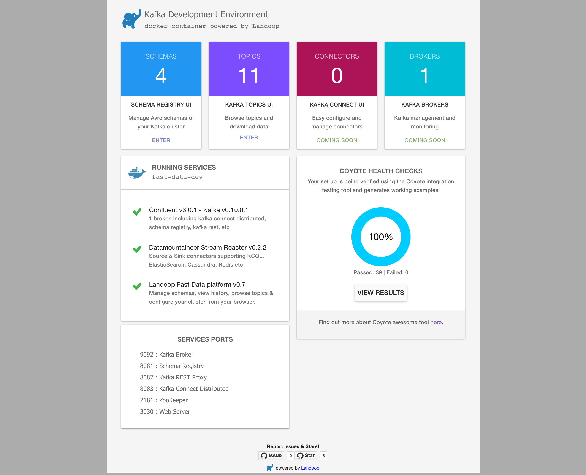
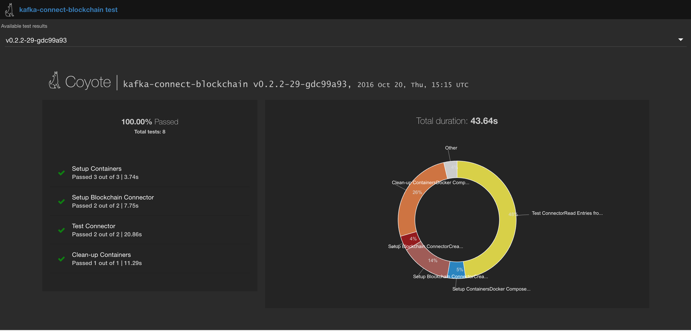

.. _install:

Install
=======

The Stream Reactor components are built around The Confluent Platform. They rely on the Kafka Brokers, Zookeepers and
optionally the Schema Registry provided by this distribution.

The following releases are available:

-  `0.3.0 <https://github.com/datamountaineer/stream-reactor/releases/tag/0.3.0>`__
-  `0.2.5 <https://github.com/datamountaineer/stream-reactor/releases/tag/v0.2.5>`__
-  `0.2.4 <https://github.com/datamountaineer/stream-reactor/releases/tag/v0.2.4>`__
-  `0.2.3 <https://github.com/datamountaineer/stream-reactor/releases/tag/v0.2.3>`__
-  `0.2.2 <https://github.com/datamountaineer/stream-reactor/releases/tag/v0.2.2>`__

+------------------------+------------------------+------------------------+
| Kafka Version          | Confluent Version      | Stream reactor version |
+========================+========================+========================+
| 0.11.0.0               | 3.3                    | 0.3.0                  |
+------------------------+------------------------+------------------------+
| 0.10.2.0               | 3.2.2                  | 0.2.6                  |
+------------------------+------------------------+------------------------+
| 0.10.2.0               | 3.2                    | 0.2.5                  |
+------------------------+------------------------+------------------------+
| 0.10.0.1               | 3.1                    | 0.2.4                  |
+------------------------+------------------------+------------------------+
| 0.10.0.1               | 3.0.1                  | 0.2.3                  |
+------------------------+------------------------+------------------------+
| 0.10.0.1               | 3.0.1                  | 0.2.2                  |
+------------------------+------------------------+------------------------+

.. _dockers:

Docker Install
~~~~~~~~~~~~~~

All the Stream Reactor Connectors, Confluent and UI's for Connect, Schema Registry and topic browsing are available in Dockers.
The Docker images are available in `DockerHub <https://hub.docker.com/>`__ and maintained by our partner `Landoop <https://www.landoop.com/>`__

Pull the latest images:

.. sourcecode:: bash

    docker pull landoop/fast-data-dev
    docker pull landoop/fast-data-dev-connect-cluster

    #UI's
    docker pull landoop/kafka-topics-ui
    docker pull landoop/schema-registry-ui

Individual docker images are available at DataMountaineers `DockerHub <https://hub.docker.com/u/datamountaineer/dashboard/>`__.
We base our Docker images of Confluents base connector image. This contains a script that uses the environment variables
starting with `CONNECT_` to create the Kafka Connect Worker property files. A second script uses the
environment variables starting with `CONNECTOR_` to create a properties files for the actual connector we want to start.

Set the `CONNECT_` and `CONNECTOR_` environment variables accordingly when running the images. 

On start, the Docker will launch Kafka Connect and the :ref:`Connect CLI <kafka-connect-cli>` will push the the Connector configuration, created from the environment variables to Kafka Connectors
once the rest api is up.

.. important::

    We strongly recommend using Landoop's Fast Data Dev dockers. The stream reactor is prepackaged and UI's are included.

Helm Charts
^^^^^^^^^^^

Helm is a package manager for Kubernetes, Helm charts are available for Connectors `here <https://datamountaineer.github.io/helm-charts/>`__ 
and targeted toward use with the `Landscaper <https://github.com/Eneco/landscaper>`__.

Microservice architectures are all the rage and for good reason. Small, lightweight, business focused and 
independently deployable services provide scalability and isolation which it hard to achieve in monolithic systems.

However, adding and scaling lots of tiny processes, either in containers or not can pose challenges even with Kafka 
as a central data hub of your organisation. At DataMountaineer we are big fans of  KStreams and Kafka Connect but as 
the numbers deployed grow;

1.  How do you integrate with your CI/CD street?
2.  How do you ensure your design time (provenance) topology is deployed and running?
3.  How do you monitor and attach your lineage to this topology?
4.  How do you attach different monitoring and alerting criteria?
5.  How do you promote different flows to production independently?

.. image:: ../images/k8.png
   :align: left

Even if you are cool and use Dockers your landscape can still be complex…handling multi tenancy, inspecting and 
managing docker files, handling service discovery, environment variables and promotion to production.

Kafka Connect and KStreams play well in containers, all state is stored or backed up in Kafka so Eneco 
started moving off virtual machines onto Kubernetes. When doing this we set out with some goals in mind 
about how to manage the dataflows that were to be deployed;

1.  Have a blueprint of what the landscape (apps in the cluster) looks like
2.  Keep track of changes: when, what, why and by who;
3.  Allow others to review changes before applying them;
4.  Let the changes be promoted to specific environments.

This resulted in the Landscaper which takes a repository containing a desired state description of the landscape 
and eliminates difference between desired and actual state of releases in a Kubernetes cluster.

Add the Helm charts to your Helm instance:

.. sourcecode:: bash

    helm repo add datamountaineer https://datamountaineer.github.io/helm-charts/

Stream Reactor Install
~~~~~~~~~~~~~~~~~~~~~~

Download the latest release from `here <https://github.com/datamountaineer/stream-reactor/releases>`__.

Unpack the archive:

.. sourcecode:: bash

    #Stream reactor release
    mkdir stream-reactor
    tar xvf stream-reactor-0.3.0-3.3.0.tar.gz -C stream-reactor

Within the unpacked directory you will find the following structure:

.. sourcecode:: bash

    .
    |-- LICENSE
    |-- README.md
    |-- bin
    |   |-- connect-cli
    |   |-- sr-cli-linux
    |   |-- sr-cli-osx
    |   `-- start-connect
    |-- conf
    |   |-- azure-docdb-sink.properties
    |   |-- blockchain-source.properties
    |   |-- bloomberg-source.properties
    |   |-- cassandra-sink.properties
    |   |-- cassandra-source-incr.properties
    |   |-- cassandra-source.properties
    |   |-- coap-hazelcast-sink.properties
    |   |-- coap-hazelcast-source.properties
    |   |-- coap-sink.properties
    |   |-- coap-source.properties
    |   |-- druid-sink.properties
    |   |-- elastic-sink.properties
    |   |-- elastic5-sink.properties
    |   |-- ftp-source.properties
    |   |-- hazelcast-sink.properties
    |   |-- hbase-sink.properties
    |   |-- influxdb-sink.properties
    |   |-- jms-sink.properties
    |   |-- jms-source.properties
    |   |-- kudu-sink.properties
    |   |-- mongodb-sink.properties
    |   |-- mqtt-source.properties
    |   |-- mqtt-sink.properties
    |   |-- redis-sink.properties
    |   |-- rethink-sink.properties
    |   |-- rethink-source.properties
    |   |-- voltdb-sink.properties
    |   `-- yahoo-source.properties
    `-- libs
        |-- kafka-connect-azure-documentdb-0.3.0-3.3.0-all.jar
        |-- kafka-connect-blockchain-0.3.0-3.3.0-all.jar
        |-- kafka-connect-bloomberg-0.3.0-3.3.0-all.jar
        |-- kafka-connect-cassandra-0.3.0-3.3.0-all.jar
        |-- kafka-connect-coap-0.3.0-3.3.0-all.jar
        |-- kafka-connect-druid-0.3.0-3.3.0-all.jar
        |-- kafka-connect-elastic-0.3.0-3.3.0-all.jar
        |-- kafka-connect-elastic5-0.3.0-3.3.0-all.jar
        |-- kafka-connect-ftp-0.3.0-3.3.0-all.jar
        |-- kafka-connect-hazelcast-0.3.0-3.3.0-all.jar
        |-- kafka-connect-hbase-0.3.0-3.3.0-all.jar
        |-- kafka-connect-influxdb-0.3.0-3.3.0-all.jar
        |-- kafka-connect-jms-0.3.0-3.3.0-all.jar
        |-- kafka-connect-kudu-0.3.0-3.3.0-all.jar
        |-- kafka-connect-mongodb-0.3.0-3.3.0-all.jar
        |-- kafka-connect-mqtt-0.3.0-3.3.0-all.jar
        |-- kafka-connect-redis-0.3.0-3.3.0-all.jar
        |-- kafka-connect-rethink-0.3.0-3.3.0-all.jar
        |-- kafka-connect-voltdb-0.3.0-3.3.0-all.jar
        `-- kafka-connect-yahoo-0.3.0-3.3.0-all.jar

The ``libs`` folder contains all the Stream Reactor Connector jars.

Install Confluent
~~~~~~~~~~~~~~~~~

Confluent can be downloaded for `here <http://www.confluent.io/download/>`__

.. sourcecode:: bash

    #make confluent home folder
    ➜  mkdir confluent

    #download confluent
    ➜  wget http://packages.confluent.io/archive/3.3/confluent-3.3.0-2.11.tar.gz 

    #extract archive to confluent folder
    ➜  tar -xvf confluent-3.3.0-2.11.tar.gz -C confluent

    #setup variables
    ➜  export CONFLUENT_HOME=~/confluent/confluent-3.3.0

Start the Confluent platform. Confluent have introduced a new CLI to start the platform, in addtion a new ``plugins.path``
has been add to Kafka Connect. This provides classloader isolation for all Connectors found under this location,
improving many dependency issues that are seen at runtime.

Edit the ``$CONFLUENT_HOME/etc/schema-registry/connect-avro-distributed.properties`` and set the ``plugin.path`` to the
location you unzipped the location of `$STREAMREACTOR_HOME` you set earlier.

Now start the Confluent Platform

.. sourcecode:: bash

    #start the whole platform
    $CONFLUENT_HOME/bin/confluent start
   
Examine the ``help`` menu of the `confluent` cli to see other options. For example:

.. sourcecode:: bash
 
 # Stop the platform
 confluent stop

 # Get the logs from Connect
 confluent log connect

 # Follow logs from Connect
 confluent log connect -f

Release Notes
~~~~~~~~~~~~~

3.0.0
^^^^^

**Features**

*   Upgrade CoAP to 2.0.0-M4
*   Upgrade to Confluent 3.3 and Kafka 0.11.0.0.
*   Added MQTT Sink.
*   Add MQTT wildcard support.
*   Upgrade CoAP to 2.0.0-M4.
*   Added WITHCONVERTERS and WITHTYPE to JMS and MQTT connectors in KCQL to simplify configuration.
*   Add flush mode to Kudu sink with a PR from @patsak. Thanks

0.2.6 (Pending)
^^^^^^^^^^^^^^^

**Features**

*   Upgrade to Confluent 3.2.2
*   Upgrade to KCQL 2x
*   Add CQL generator to Cassandra source
*   Add KCQL INCREMENTALMODE support to the Cassandra source, bulk mode and the timestamp column type is now take from KCQL
*   Support for setting key and truststore type on Cassandra connectors
*   Added token based paging support for Cassandra source
*   Added default bytes converter to JMS Source
*   Added default connection factory to JMS Source
*   Added support for SharedDurableConsumers to JMS Connectors
*   Upgraded JMS Connector to JMS 2.0
*   Moved to Elastic4s 2.4
*   Added Elastic5s with TCP, TCP+XPACK and HTTP client support
*   Upgrade Azure Documentdb to 1.11.0
*   Added optional progress counter to all connectors, it can be enabled with ``connect.progress.enabled`` which will periodically report log messages processed
*   Added authentication and TLS to ReThink Connectors
*   Added TLS support for ReThinkDB, add batch size option to source for draining the internal queues.
*   Upgrade Kudu Client to 1.4.0
*   Support for dates in Elastic Indexes and custom document types
*   Upgrade Connect CLI to 1.0.2 (Renamed to connect-cli)

**Bug Fixes**

*   Fixes for high CPU on CoAP source
*   Fixes for high CPU on Cassandra source
*   Fixed Avro double fields mapping to Kudu columns
*   Fixes on JMS properties converter, Invalid schema when extracting properties

**Misc**

*   Refactored Cassandra Tests to use only one embedded instance
*   Removed unused batch size and bucket size options from Kudu, they are taken from KCQL
*   Removed unused batch size option from DocumentDb
*   Rename Azure DocumentDb `connect.documentdb.db` to `connect.documentdb.db`
*   Rename Azure DocumentDb `connect.documentdb.database.create` to `connect.documentdb.db.create`
*   Rename Cassandra Source `connect.cassandra.source.kcql` to `connect.cassandra.kcql`
*   Rename Cassandra Source `connect.cassandra.source.timestamp.type` to `connect.cassandra.timestamp.type`
*   Rename Cassandra Source `connect.cassandra.source.import.poll.interval` to `connect.cassandra.import.poll.interval`
*   Rename Cassandra Source `connect.cassandra.source.error.policy` to `connect.cassandra.error.policy`
*   Rename Cassandra Source `connect.cassandra.source.max.retries` to `connect.cassandra.max.retries`
*   Rename Cassandra Sink `connect.cassandra.source.retry.interval` to `connect.cassandra.retry.interval`
*   Rename Cassandra Sink `connect.cassandra.sink.kcql` to `connect.cassandra.kcql`
*   Rename Cassandra Sink `connect.cassandra.sink.error.policy` to `connect.cassandra.error.policy`
*   Rename Cassandra Sink `connect.cassandra.sink.max.retries` to `connect.cassandra.max.retries`
*   Rename Cassandra Sink Sink `connect.cassandra.sink.retry.interval` to `connect.cassandra.retry.interval`
*   Rename Coap Source `connect.coap.bind.port` to `connect.coap.port`
*   Rename Coap Sink `connect.coap.bind.port` to `connect.coap.port`
*   Rename Coap Source `connect.coap.bind.host` to `connect.coap.host`
*   Rename Coap Sink `connect.coap.bind.host` to `connect.coap.host`
*   Rename MongoDb `connect.mongo.database` to `connect.mongo.db`
*   Rename MongoDb `connect.mongo.sink.batch.size` to `connect.mongo.batch.size`
*   Rename Druid `connect.druid.sink.kcql` to `connect.druid.kcql`
*   Rename Druid `connect.druid.sink.conf.file` to `connect.druid.kcql`
*   Rename Druid `connect.druid.sink.write.timeout` to `connect.druid.write.timeout`
*   Rename Elastic `connect.elastic.sink.kcql` to `connect.elastic.kcql`
*   Rename HBase `connect.hbase.sink.column.family` to `connect.hbase.column.family`
*   Rename HBase `connect.hbase.sink.kcql` to `connect.hbase.kcql`
*   Rename HBase `connect.hbase.sink.error.policy` to `connect.hbase.error.policy`
*   Rename HBase `connect.hbase.sink.max.retries` to `connect.hbase.max.retries`
*   Rename HBase `connect.hbase.sink.retry.interval` to `connect.hbase.retry.interval`
*   Rename Influx `connect.influx.sink.kcql` to `connect.influx.kcql`
*   Rename Influx `connect.influx.connection.user` to `connect.influx.username`
*   Rename Influx `connect.influx.connection.password` to `connect.influx.password`
*   Rename Influx `connect.influx.connection.database` to `connect.influx.db`
*   Rename Influx `connect.influx.connection.url` to `connect.influx.url`
*   Rename Kudu `connect.kudu.sink.kcql` to `connect.kudu.kcql`
*   Rename Kudu `connect.kudu.sink.error.policy` to `connect.kudu.error.policy`
*   Rename Kudu `connect.kudu.sink.retry.interval` to `connect.kudu.retry.interval`
*   Rename Kudu `connect.kudu.sink.max.retries` to `connect.kudu.max.reties`
*   Rename Kudu `connect.kudu.sink.schema.registry.url` to `connect.kudu.schema.registry.url`
*   Rename Redis `connect.redis.connection.password` to `connect.redis.password` 
*   Rename Redis `connect.redis.sink.kcql` to `connect.redis.kcql`
*   Rename Redis `connect.redis.connection.host` to `connect.redis.host`
*   Rename Redis `connect.redis.connection.port` to `connect.redis.port` 
*   Rename ReThink `connect.rethink.source.host` to `connect.rethink.host`
*   Rename ReThink `connect.rethink.source.port` to `connect.rethink.port`
*   Rename ReThink `connect.rethink.source.db` to `connect.rethink.db`
*   Rename ReThink `connect.rethink.source.kcql` to `connect.rethink.kcql`
*   Rename ReThink Sink `connect.rethink.sink.host` to `connect.rethink.host`
*   Rename ReThink Sink `connect.rethink.sink.port` to `connect.rethink.port`
*   Rename ReThink Sink `connect.rethink.sink.db` to `connect.rethink.db`
*   Rename ReThink Sink `connect.rethink.sink.kcql` to `connect.rethink.kcql`
*   Rename JMS `connect.jms.user` to `connect.jms.username`
*   Rename JMS `connect.jms.converters.source` to `connect.jms.converters`
*   Remove JMS `connect.jms.converters` and replace my kcql `withConverters`
*   Remove JMS `connect.jms.queues` and replace my kcql `withType=QUEUE`
*   Remove JMS `connect.jms.topics` and replace my kcql `withType=TOPIC`
*   Rename Mqtt `connect.mqtt.source.kcql` to `connect.mqtt.kcql`
*   Rename Mqtt `connect.mqtt.user` to `connect.mqtt.username`
*   Rename Mqtt `connect.mqtt.hosts` to `connect.mqtt.connection.hosts`
*   Remove Mqtt `connect.mqtt.converters` and replace my kcql `withConverters`
*   Remove Mqtt `connect.mqtt.queues` and replace my kcql `withType=QUEUE`
*   Remove Mqtt `connect.mqtt.topics` and replace my kcql `withType=TOPIC`
*   Rename Hazelcast `connect.hazelcast.sink.kcql` to `connect.hazelcast.kcql`
*   Rename Hazelcast `connect.hazelcast.sink.group.name` to `connect.hazelcast.group.name`
*   Rename Hazelcast `connect.hazelcast.sink.group.password` to `connect.hazelcast.group.password`
*   Rename Hazelcast `connect.hazelcast.sink.cluster.members` tp `connect.hazelcast.cluster.members`
*   Rename Hazelcast `connect.hazelcast.sink.batch.size` to `connect.hazelcast.batch.size`
*   Rename Hazelcast `connect.hazelcast.sink.error.policy` to `connect.hazelcast.error.policy`
*   Rename Hazelcast `connect.hazelcast.sink.max.retries` to `connect.hazelcast.max.retries`
*   Rename Hazelcast `connect.hazelcast.sink.retry.interval` to `connect.hazelcast.retry.interval`
*   Rename VoltDB `connect.volt.sink.kcql` to `connect.volt.kcql`
*   Rename VoltDB `connect.volt.sink.connection.servers` to `connect.volt.servers`
*   Rename VoltDB `connect.volt.sink.connection.user` to `connect.volt.username`
*   Rename VoltDB `connect.volt.sink.connection.password` to `connect.volt.password`
*   Rename VoltDB `connect.volt.sink.error.policy` to `connect.volt.error.policy`
*   Rename VoltDB `connect.volt.sink.max.retries` to `connect.volt.max.retries`
*   Rename VoltDB `connect.volt.sink.retry.interval` to `connect.volt.retry.interval`

0.2.5
^^^^^

*   Adding Azure DocumentDb Sink
*   Adding UPSERT to Elastic Search
*   Cassandra improvements `withunwrap`
*   Upgrade to Kudu 1.0 and CLI 1.0
*   Add ingest_time to CoAP Source
*   Support Confluent 3.2 and Kafka 0.10.2.
*   Added Azure DocumentDB.
*   Added JMS Source.
*   Added Schemaless Json and Json with schema support to JMS Sink.
*   InfluxDB bug fixes for tags and field selection.
*   Support for Cassandra data type of ``timestamp`` in the Cassandra Source for timestamp tracking.

0.2.4 (26 Jan 2017)
^^^^^^^^^^^^^^^^^^^

*   Added FTP and HTTP Source.
*   Added InfluxDB tag support. KCQL: INSERT INTO target dimension SELECT * FROM influx-topic WITHTIMESTAMP sys_time() WITHTAG(field1, CONSTANT_KEY1=CONSTANT_VALUE1, field2,CONSTANT_KEY2=CONSTANT_VALUE1)
*   Added InfluxDb consistency level. Default is ALL. Use connect.influx.consistency.level to set it to ONE/QUORUM/ALL/ANY.
*   InfluxDb connect.influx.sink.route.query was renamed to connect.influx.sink.kcql.
*   Added support for multiple contact points in Cassandra.

0.2.3 (5 Jan 2017)
^^^^^^^^^^^^^^^^^^

*   Added CoAP Source and Sink.
*   Added MongoDB Sink.
*   Added MQTT Source.
*   Hazelcast support for ring buffers, maps, sets, lists and cache.
*   Redis support for Sorted Sets.
*   Added start scripts.
*   Added Kafka Connect and Schema Registry CLI.
*   Kafka Connect CLI now supports pause/restart/resume; checking connectors on the classpath and validating configuration of connectors.
*   Support for Struct, Schema.STRING and Json with schema in the Cassandra, ReThinkDB, InfluxDB and MongoDB sinks.
*   Rename export.query.route to sink.kcql.
*   Rename import.query.route to source.kcql.
*   Upgrade to KCQL 0.9.5 - Add support for STOREAS so specify target sink types, e.g. Redis Sorted Sets, Hazelcast map, queues, ringbuffers.

Fast Data Dev
-------------

This is Docker image for development.

If you need

1.  Kafka Broker
2.  ZooKeeper
3.  Schema Registry
4.  Kafka REST Proxy
5.  Kafka Connect Distributed
6.  Certified DataMountaineer Connectors (ElasticSearch, Cassandra, Redis ..)
7.  Landoop's Fast Data Web UIs : schema-registry , kafka-topics , kafka-connect and
8.  Embedded integration tests with examples

Run with:

.. sourcecode:: bash

    docker run --rm -it --net=host landoop/fast-data-dev

On Mac OSX run:

.. sourcecode:: bash

    docker run --rm -it \
           -p 2181:2181 -p 3030:3030 -p 8081:8081 \
           -p 8082:8082 -p 8083:8083 -p 9092:9092 \
           -e ADV_HOST=127.0.0.1 \
           landoop/fast-data-dev

That's it. Your Broker is at localhost:9092, your Kafka REST Proxy at localhost:8082, your Schema Registry at
localhost:8081, your Connect Distributed at localhost:8083, your ZooKeeper at localhost:2181 and at
`<http://localhost:3030>`__ you will find Landoop's Web UIs for Kafka Topics and Schema Registry, as well as a Coyote test report.

Fast Data Dev Connect
---------------------

This docker is targeted to more advanced users and is a special case since it doesn't set-up a Kafka cluster,
instead it expects to find a Kafka Cluster with Schema Registry up and running.

The developer can then use this docker image to setup a connect-distributed cluster by just spawning a couple containers.

.. sourcecode:: bash

    docker run -d --net=host \
           -e ID=01 \
           -e BS=broker1:9092,broker2:9092 \
           -e ZK=zk1:2181,zk2:2181 \
           -e SC=http://schema-registry:8081 \
           -e HOST=<IP OR FQDN> \
           landoop/fast-data-dev-connect-cluster

Things to look out for in configuration options:

1. It is important to give a full URL (including schema —http://) for schema registry.

2. ID should be unique to the Connect cluster you setup, for current and old instances. This is because Connect stores
data in Brokers and Schema Registry. Thus even if you destroyed a Connect cluster, its data remain in your Kafka setup.

3.  HOST should be set to an IP address or domain name that other connect instances and clients can use to reach the
current instance. We chose not to try to autodetect this IP because such a feat would fail more often than not.
Good choices are your local network ip (e.g 10.240.0.2) if you work inside a local network, your public ip (if you have
one and want to use it) or a domain name that is resolvable by all the hosts you will use to talk to Connect.

If you don't want to run with --net=host you have to expose Connect's port which at default settings is 8083.
There a PORT option, that allows you to set Connect's port explicitly if you can't use the default 8083. Please remember
that it is important to expose Connect's port on the same port at the host. This is a choice we had to make for simplicity's sake.

.. sourcecode:: bash

    docker run -d \
           -e ID=01 \
           -e BS=broker1:9092,broker2:9092 \
           -e ZK=zk1:2181,zk2:2181 \
           -e SC=http://schema-registry:8081 \
           -e HOST=<IP OR FQDN> \
           -e PORT=8085 \
           -p 8085:8085 \
           landoop/fast-data-dev-connect-cluster

Advanced
^^^^^^^^

The container does not exit with CTRL+C. This is because we chose to pass control directly to Connect, so you check your logs via docker logs.
You can stop it or kill it from another terminal.

Whilst the PORT variable sets the rest.port, the HOST variable sets the advertised host. This is the hostname that
Connect will send to other Connect instances. By default Connect listens to all interfaces, so you don't have to worry
as long as other instances can reach each instance via the advertised host.

Latest Test Results
-------------------

To see the latest tests for the Connectors, in a docker, please visit Landoop's test github `here <https://github.com/Landoop/kafka-connectors-tests>`__
Test results can be found `here <https://coyote.landoop.com/connect/>`__.

An example for BlockChain is:

.. figure:: ../images/blockchain-coyote-bottom.png
    :alt:

