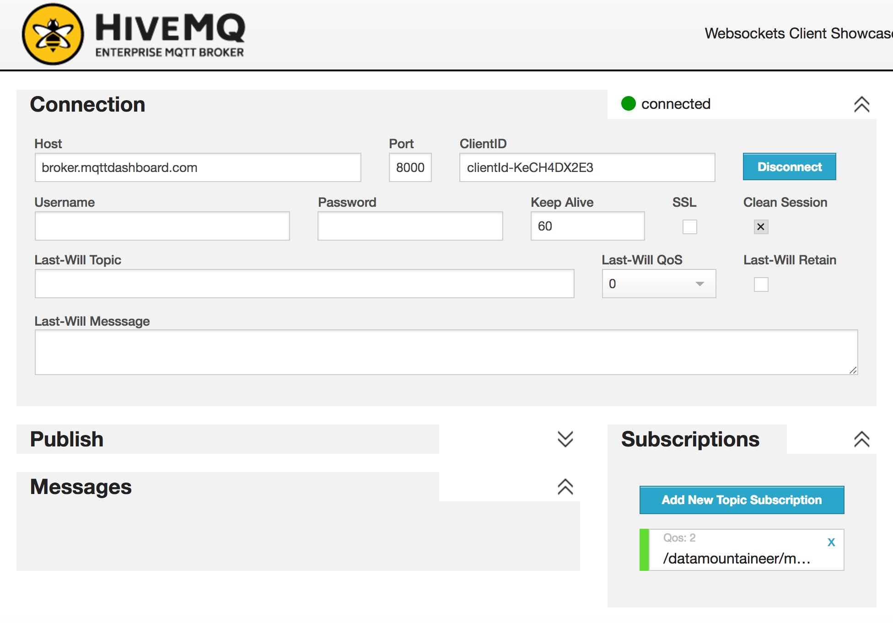
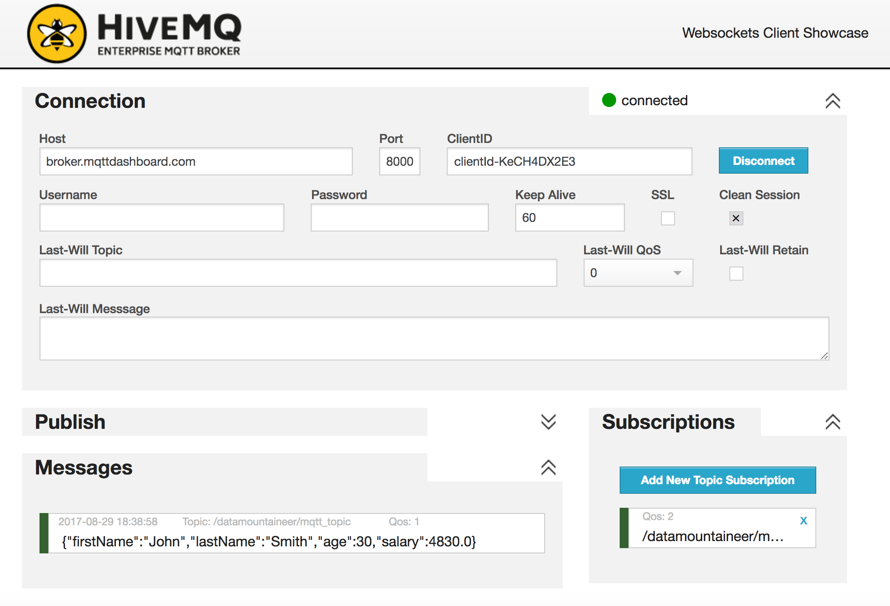

Kafka Connect MQTT Sink
=======================

A Connector and Sink to stream messages from Kafka to a MQTT brokers.

The Sink supports:

1. :ref:`The KCQL routing querying <kcql>` - Topic to measure mapping and Field selection.
2. Error policies.
3. Payload support for Schema.Struct and payload Struct, Schema.String and Json payload and Json payload with no schema

The Sink supports three Kafka payloads type:

**Connect entry with Schema.Struct and payload Struct.** If you follow the best practice while producing the events, each
message should carry its schema information. Best option is to send Avro. Your connect configurations should be set to
``value.converter=io.confluent.connect.avro.AvroConverter``.
You can find an example `here <https://github.com/confluentinc/kafka-connect-blog/blob/master/etc/connect-avro-standalone.properties>`__.
To see how easy is to have your producer serialize to Avro have a look at
`this <http://docs.confluent.io/3.0.1/schema-registry/docs/serializer-formatter.html?highlight=kafkaavroserializer>`__.
This requires the SchemaRegistry which is open source thanks to Confluent! Alternatively you can send Json + Schema.
In this case your connect configuration should be set to ``value.converter=org.apache.kafka.connect.json.JsonConverter``. This doesn't
require the SchemaRegistry.

**Connect entry with Schema.String and payload json String.** Sometimes the producer would find it easier, despite sending
Avro to produce a GenericRecord, to just send a message with Schema.String and the json string.

**Connect entry without a schema and the payload json String.** There are many existing systems which are publishing json
over Kafka and bringing them in line with best practices is quite a challenge. Hence we added the support

The payload of the MQTT message sent to the MQTT broker is sent as json.

Prerequisites
-------------

- Confluent 3.3
- Java 1.8
- Scala 2.11
- Mqtt server

Setup
-----

Confluent Setup
~~~~~~~~~~~~~~~

Follow the instructions :ref:`here <install>`.

MQTT Setup
~~~~~~~~~~

HiveMQ, who privode enterprize MQTT brokers have a webclient we'll use for the quickstart. Go to this `link <http://www.hivemq.com/demos/websocket-client/>`__, connect and set
up a subscription to ```/datamountaineer/mqtt_sink_topic/+``` topic. You should see this.



Now we have a webclient listening for messages which will come from the MQTT Sink.

Sink Connector QuickStart
-------------------------

We you start the Confluent Platform, Kafka Connect is started in distributed mode (``confluent start``). 
In this mode a Rest Endpoint on port ``8083`` is exposed to accept connector configurations. 
We developed Command Line Interface to make interacting with the Connect Rest API easier. The CLI can be found in the Stream Reactor download under
the ``bin`` folder. Alternatively the Jar can be pulled from our GitHub
`releases <https://github.com/datamountaineer/kafka-connect-tools/releases>`__ page.

Starting the Connector
~~~~~~~~~~~~~~~~~~~~~~

Download, unpack and install the Stream Reactor and Confluent. Follow the instructions :ref:`here <install>` if you haven't already done so.
All paths in the quickstart are based in the location you installed the Stream Reactor.

Once the Connect has started we can now use the kafka-connect-tools :ref:`cli <kafka-connect-cli>` to post in our distributed properties file for MQTT.
If you are using the :ref:`dockers <dockers>` you will have to set the following environment variable to for the CLI to
connect to the Rest API of Kafka Connect of your container.

.. sourcecode:: bash

   export KAFKA_CONNECT_REST="http://myserver:myport"

.. sourcecode:: bash

    ➜  bin/connect-cli create mqtt-sink < conf/mqtt-sink.properties

    #Connector name=`mqtt-sink`
    name=mqtt-sink
    tasks.max=1
    connector.class=com.datamountaineer.streamreactor.connect.mqtt.sink.MqttSinkConnector  
    topics=kafka-topic
    connect.mqtt.hosts=tcp://broker.mqttdashboard.com:1883
    connect.mqtt.kcql=INSERT INTO /datamountaineer/mqtt_topic SELECT * FROM kafka-topic
    connect.mqtt.clean=true
    connect.mqtt.timeout=1000
    connect.mqtt.keep.alive=1000
    connect.mqtt.client.id=dm_sink_id,
    connect.mqtt.service.quality=1
    tasks.max=1
    #task ids: 0

The ``mqtt-sink.properties`` file defines:

1.  The name of the sink.
2.  The name number of tasks.
3.  The class containing the connector.
4.  The url of the HiveMQ public Server and port to connect to.
5.  :ref:`The KCQL routing querying. <kcql>`. This specifies the target topic on the Mqtt server and the source kafka topics.
6.  The topics to source (Required by Connect Framework).

Use the Confluent CLI to view Connects logs.

.. sourcecode:: bash

    # Get the logs from Connect
    confluent log connect

    # Follow logs from Connect
    confluent log connect -f

.. sourcecode:: bash

    INFO Kafka commitId : 5cadaa94d0a69e0d (org.apache.kafka.common.utils.AppInfoParser:84)
    INFO Setting task configurations for 1 workers. (com.datamountaineer.streamreactor.connect.mqtt.sink.MqttSinkConnector:52)
    INFO Finished starting connectors and tasks (org.apache.kafka.connect.runtime.distributed.DistributedHerder:825)
    INFO
        ____        __        __  ___                  __        _
       / __ \____ _/ /_____ _/  |/  /___  __  ______  / /_____ _(_)___  ___  ___  _____
      / / / / __ `/ __/ __ `/ /|_/ / __ \/ / / / __ \/ __/ __ `/ / __ \/ _ \/ _ \/ ___/
     / /_/ / /_/ / /_/ /_/ / /  / / /_/ / /_/ / / / / /_/ /_/ / / / / /  __/  __/ /
    /_____/\__,_/\__/\__,_/_/  /_/\____/\__,_/_/ /_/\__/\__,_/_/_/ /_/\___/\___/_/
             __  _______  ____________   _____ _       __
            /  |/  / __ \/_  __/_  __/  / ___/(_)___  / /__
           / /|_/ / / / / / /   / /     \__ \/ / __ \/ //_/  By Andrew Stevenson
          / /  / / /_/ / / /   / /     ___/ / / / / / ,<
         /_/  /_/\___\_\/_/   /_/     /____/_/_/ /_/_/|_|
      (com.datamountaineer.streamreactor.connect.mqtt.sink.MqttSinkTask:41)
    INFO MqttSinkConfig values: 
        connect.mqtt.clean = true
        connect.mqtt.client.id = dm_sink_id,
        connect.mqtt.converter.throw.on.error = false
        connect.mqtt.error.policy = THROW
        connect.mqtt.hosts = tcp://broker.mqttdashboard.com:1883
        connect.mqtt.kcql = INSERT INTO /datamountaineer/mqtt_topic SELECT * FROM kafka-topic
        connect.mqtt.keep.alive = 1000
        connect.mqtt.max.retries = 20
        connect.mqtt.password = null
        connect.mqtt.retry.interval = 60000
        connect.mqtt.service.quality = 1
        connect.mqtt.ssl.ca.cert = null
        connect.mqtt.ssl.cert = null
        connect.mqtt.ssl.key = null
        connect.mqtt.timeout = 1000
        connect.mqtt.username = null
        connect.progress.enabled = true
    (com.datamountaineer.streamreactor.connect.mqtt.config.MqttSinkConfig:223)

We can use the CLI to check if the connector is up but you should be able to see this in logs as-well.

.. sourcecode:: bash

    #check for running connectors with the CLI
    ➜ bin/connect-cli ps
    mqtt-sink

Test Records
^^^^^^^^^^^^

Now we need to put some records it to the kafka_topic topics. We can use the ``kafka-avro-console-producer`` to do this.

Start the producer and pass in a schema to register in the Schema Registry. The schema has a ``firstname`` field of type
string, a ``lastname`` field of type string, an ``age`` field of type int and a ``salary`` field of type double.

.. sourcecode:: bash

    ${CONFLUENT_HOME}/bin/kafka-avro-console-producer \
      --broker-list localhost:9092 --topic kafka-topic \
      --property value.schema='{"type":"record","name":"User","namespace":"com.datamountaineer.streamreactor.connect.mqtt"
      ,"fields":[{"name":"firstName","type":"string"},{"name":"lastName","type":"string"},{"name":"age","type":"int"},{"name":"salary","type":"double"}]}'

Now the producer is waiting for input. Paste in the following:

.. sourcecode:: bash

    {"firstName": "John", "lastName": "Smith", "age":30, "salary": 4830}


Check for Records in the MQTT Broker
^^^^^^^^^^^^^^^^^^^^^^^^^^^^^^^^^^^^

Go back to browser you started the HiveMQ webclient in. You should see the messages arrive in the messages section.



Features
--------

Kafka Connect Query Language
~~~~~~~~~~~~~~~~~~~~~~~~~~~~

**K** afka **C** onnect **Q** uery **L** anguage found here `GitHub repo <https://github.com/datamountaineer/kafka-connector-query-language>`__
allows for routing and mapping using a SQL like syntax, consolidating typically features in to one configuration option.

The CoAP Sink supports the following:

.. sourcecode:: bash

    INSERT INTO <resource> SELECT <fields> FROM <source topic>

Example:

.. sourcecode:: sql

    #Insert mode, select all fields from topicA and write to topicA
    INSERT INTO topicA SELECT * FROM topicA

    #Insert mode, select 3 fields and rename from topicB and write to topicA
    INSERT INTO topicA SELECT x AS a, y AS b and z AS c FROM topicB

This is set in the ``connect.mqtt.kcql`` option.

Error Polices
~~~~~~~~~~~~~

The Sink has three error policies that determine how failed writes to the target database are handled. The error policies
affect the behaviour of the schema evolution characteristics of the sink. See the schema evolution section for more
information.

**Throw**

Any error on write to the target database will be propagated up and processing is stopped. This is the default
behaviour.

**Noop**

Any error on write to the target database is ignored and processing continues.

.. warning::

    This can lead to missed errors if you don't have adequate monitoring. Data is not lost as it's still in Kafka
    subject to Kafka's retention policy. The Sink currently does **not** distinguish between integrity constraint
    violations and or other expections thrown by drivers.

**Retry**

Any error on write to the target database causes the RetryIterable exception to be thrown. This causes the
Kafka connect framework to pause and replay the message. Offsets are not committed. For example, if the table is offline
it will cause a write failure, the message can be replayed. With the Retry policy the issue can be fixed without stopping
the sink.

The length of time the Sink will retry can be controlled by using the ``connect.mqtt.max.retries`` and the
``connect.mqtt.retry.interval``.

Configurations
--------------

``connect.mqtt.kcql``

Kafka connect query language expression. Allows for expressive Mqtt topic to Kafka topic routing. Currently there is no support
for filtering the fields from the incoming payload.

* Data type : string
* Importance: high
* Optional  : no

``connect.mqtt.hosts``

Specifies the mqtt connection endpoints.

* Data type : string
* Importance: high
* Optional  : no

Example:

.. sourcecode:: bash

  tcp://broker.datamountaineer.com:1883

``connect.mqtt.service.quality``

The Quality of Service (QoS) level is an agreement between sender and receiver of a message regarding the guarantees of delivering a message. There are 3 QoS levels in MQTT:
At most once (0); At least once (1); Exactly once (2).

* Data type : int
* Importance: high
* Optional  : yes
* Default:    1

``connect.mqtt.username``

Contains the Mqtt connection user name

* Data type : string
* Importance: medium
* Optional  : yes
* Default:    null

``connect.mqtt.password``

Contains the Mqtt connection password

* Data type : string
* Importance: medium
* Optional  : yes
* Default:     null

``connect.mqtt.client.id``

Provides the client connection identifier. If is not provided the framework will generate one.

* Data type:  string
* Importance: medium
* Optional:   yes
* Default:    generated

``connect.mqtt.connection.timeout``

Sets the timeout to wait for the broker connection to be established

* Data type:  int
* Importance: medium
* Optional:   yes
* Default:    3000 (ms)

``connect.mqtt.connection.clean``

The clean session flag indicates the broker, whether the client wants to establish a persistent session or not.
A persistent session (the flag is false) means, that the broker will store all subscriptions for the client and also all missed messages,
when subscribing with Quality of Service (QoS) 1 or 2. If clean session is set to true, the broker won’t store anything for the client and will
also purge all information from a previous persistent session.

* Data type:  boolean
* Importance: medium
* Optional:   yes
* Default:    true


``connect.mqtt.connection.keep.alive``

The keep alive functionality assures that the connection is still open and both broker and client are connected to one another.
Therefore the client specifies a time interval in seconds and communicates it to the broker during the establishment of the connection.
The interval is the longest possible period of time, which broker and client can endure without sending a message.

* Data type:  int
* Importance: medium
* Optional:   yes
* Default:    5000

``connect.mqtt.connection.ssl.ca.cert``

Provides the path to the CA certificate file to use with the Mqtt connection

* Data type:  string
* Importance: medium
* Optional:   yes
* Default:    null

``connect.mqtt.connection.ssl.cert``

Provides the path to the certificate file to use with the Mqtt connection

* Data type:  string
* Importance: medium
* Optional:   yes
* Default:    null

``connect.mqtt.connection.ssl.key``

Certificate private key file path.

* Data type:  string
* Importance: medium
* Optional:   yes
* Default:    null

``connect.progress.enabled``

Enables the output for how many records have been processed.

* Type: boolean
* Importance: medium
* Optional: yes
* Default : false

Deployment Guidelines
---------------------

Distributed Mode
~~~~~~~~~~~~~~~~

Connect, in production should be run in distributed mode. 

1.  Install the Confluent Platform on each server that will form your Connect Cluster.
2.  Create a folder on the server called ``plugins/streamreactor/libs``.
3.  Copy into the folder created in step 2 the required connector jars from the stream reactor download.
4.  Edit ``connect-avro-distributed.properties`` in the ``etc/schema-registry`` folder where you installed Confluent
    and uncomment the ``plugin.path`` option. Set it to the path you deployed the stream reactor connector jars
    in step 2.
5.  Start Connect, ``bin/connect-distributed etc/schema-registry/connect-avro-distributed.properties``

Connect Workers are long running processes so set an ``init.d`` or ``systemctl`` service accordingly.

Connector configurations can then be push to any of the workers in the Cluster via the CLI or curl, if using the CLI 
remember to set the location of the Connect worker you are pushing to as it defaults to localhost.

.. sourcecode:: bash

    export KAFKA_CONNECT_REST="http://myserver:myport"

Kubernetes
~~~~~~~~~~

Helm Charts are provided at our `repo <https://datamountaineer.github.io/helm-charts/>`__, add the repo to your Helm instance and install. We recommend using the Landscaper
to manage Helm Values since typically each Connector instance has it's own deployment.

Add the Helm charts to your Helm instance:

.. sourcecode:: bash

    helm repo add datamountaineer https://datamountaineer.github.io/helm-charts/


TroubleShooting
---------------

Please review the :ref:`FAQs <faq>` and join our `slack channel <https://slackpass.io/datamountaineers>`_.