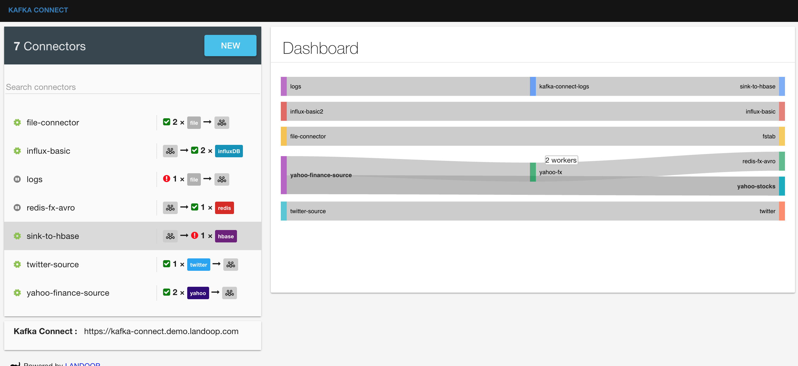
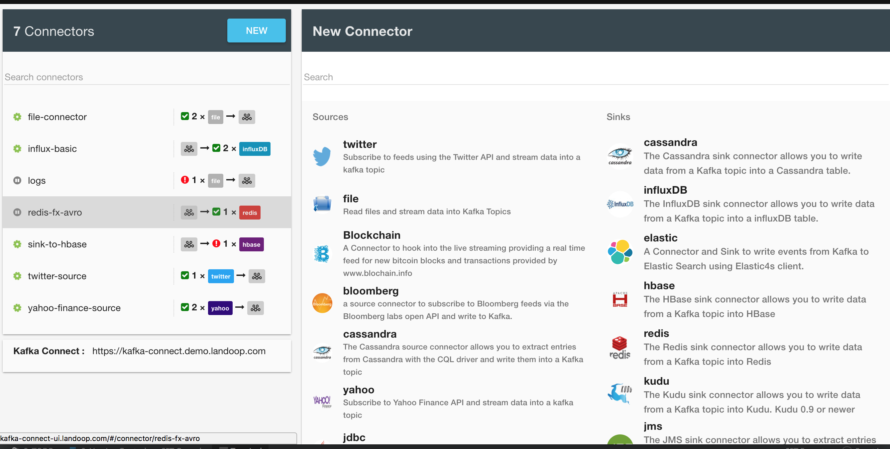
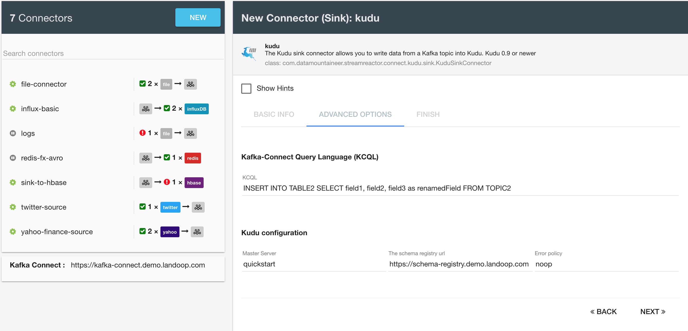

.. _ui:

Fast Data UI's (Landoop)
========================

Landoop has a number of UI's available to visually data in Kafka and schemas in the Schema Registry.

You can either build from their GitHub repo or install and run the docker images.

*   `Kafka Topics Browser <https://github.com/Landoop/kafka-topics-ui>`__
*   `Schema Registry <https://github.com/Landoop/schema-registry-ui>`__
*   `Kafka Connect <http://kafka-connect-ui.landoop.com/#/>`__

Kafka Connect UI
----------------

The Kafka Connect UI lets you:

*   Visualise your connect cluster sink & sources.
*   Create new connectors with few clicks.
*   Update & Delete connectors configuration.
*   View workers tasks health & failures.

For the Connect UI please contact `Landoop <https://www.landoop.com/>`__.

Add new connectors.

Kafka Topic Browser
-------------------

The Kafka Topic Browser allows you to look into topic without having to write code or use the command line console consumers.

Supported features are:

*   Find topics & browse topic data (kafka messages)
*   View topic metadata
*   View topic configuration
*   Download data

.. figure:: ../images/landoop-topic-1.png
    :alt:

.. figure:: ../images/landoop-topic-2.png
    :alt:

Schema Registry Browser
-----------------------

The Schema Registry is an integral part of the Kafka Streaming Platform.

Schema Registry provides a serving layer for your metadata. It provides a RESTful interface for storing and
retrieving Avro schemas. It stores a versioned history of all schemas, provides multiple compatibility settings
and allows evolution of schemas according to the configured compatibility setting. It provides serializers that plug
into Kafka clients that handle schema storage and retrieval for Kafka messages that are sent in the Avro format.

Our web tool for schema registry allows:

*   Visibility of schemas and their versions in the topics
*   Schema validation
*   Ability to add new schemas
*   Ability to track changes with a graphical diff.

.. figure:: ../images/landoop-schema.gif
    :alt:

Install
-------

For docker, pull the images:

.. sourcecode:: bash

    docker pull landoop/kafka-topics-ui
    docker pull landoop/schema-registry-ui

To run

.. sourcecode:: bash

    docker run --rm -it -p 8000:8000 \
           -e "SCHEMAREGISTRY_URL=http://confluent-schema-registry-host:port" \
           landoop/schema-registry-ui

    docker run --rm -it -p 8000:8000 \
            -e "KAFKA_REST_PROXY_URL=http://kafka-rest-proxy-host:port" \
               landoop/kafka-topics-ui

    #Start both in one docker
    #docker run --rm -it -p 8000:8000 \
    #       -e "SCHEMAREGISTRY_UI_URL=http://confluent-schema-registry-host:port" \
    #       -e "KAFKA_REST_PROXY_URL=http://kafka-rest-proxy-host:port" \
    #       landoop/kafka-topics-ui

Your schema-registry service will need to allow CORS (!!)

To do that, and in ``/opt/confluent-3.0.0/etc/schema-registry/schema-registry.properties``

.. sourcecode:: bash

    access.control.allow.methods=GET,POST,OPTIONS
    access.control.allow.origin=*
